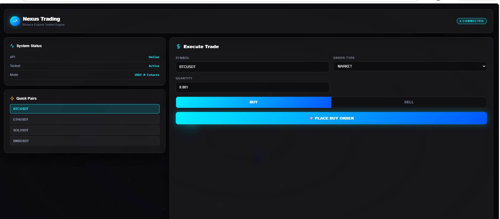

# 🚀 Binance Futures Trading Bot (USDT-M Testnet)
<p align="center">  </p>

<p align="center">

</p>
A production ready Python trading bot for **Binance Futures Testnet (USDT-M)** that enables users to place **Market** and **Limit** orders through a modern Command Line Interface (CLI). The project follows clean architecture principles, includes structured logging, comprehensive input validation, robust error handling, and an optional modern web dashboard.

---

# 📌 Project Overview

This project was developed as part of a **Python Developer Application Task**. The application demonstrates practical experience with REST APIs, modular software architecture, CLI development, logging, exception handling, and Python best practices.

The bot connects to the **Binance Futures Testnet** and allows users to safely simulate cryptocurrency futures trading without using real funds.

---

# ✨ Features

* ✅ Place **Market Orders**
* ✅ Place **Limit Orders**
* ✅ Support for **BUY** and **SELL** positions
* ✅ Binance USDT-M Futures Testnet integration
* ✅ Secure API credential management using `.env`
* ✅ Interactive CLI built with **Typer** and **Rich**
* ✅ Input validation for trading parameters
* ✅ Structured logging for requests, responses, and errors
* ✅ Exception handling for API and network failures
* ✅ FastAPI backend for future extensions
* ✅ Optional React + Tailwind dashboard
* ✅ Modular and reusable architecture
* ✅ Beginner-friendly and maintainable codebase

---

# 🛠️ Tech Stack

## Backend

* Python 3.11+
* FastAPI
* Uvicorn
* python-binance
* Typer
* Rich
* Pydantic
* python-dotenv

## Frontend (Optional)

* React
* Vite
* Tailwind CSS
* Three.js
* Framer Motion

## Testing

* Pytest

---

# 📂 Project Structure

```text
trading_bot/
│
├── bot/
│   ├── __init__.py
│   ├── client.py
│   ├── orders.py
│   ├── validators.py
│   ├── logger.py
│   ├── config.py
│   ├── exceptions.py
│   └── helpers.py
│
├── frontend/
│
├── logs/
│   ├── market_order.log
│   ├── limit_order.log
│   └── error.log
│
├── tests/
│
├── cli.py
├── main.py
├── requirements.txt
├── README.md
├── .env.example
└── pytest.ini
```

---

# ⚙️ Installation

Clone the repository:

```bash
git clone https://github.com/AiErAshutoshSingh/Python-Development-Intern.git
cd Python-Development-Intern
```

Create a virtual environment:

```bash
python -m venv venv
```

Activate the virtual environment:

### Windows

```bash
venv\Scripts\activate
```

### Linux / macOS

```bash
source venv/bin/activate
```

Install dependencies:

```bash
pip install -r requirements.txt
```

---

# 🔑 Environment Variables

Create a `.env` file in the project root.

```env
BINANCE_API_KEY=YOUR_TESTNET_API_KEY
BINANCE_SECRET_KEY=YOUR_TESTNET_SECRET_KEY
BINANCE_BASE_URL=https://testnet.binancefuture.com
```

> **Important:** Never commit your `.env` file or API credentials to GitHub.

---

# ▶️ Running the Application

Run the CLI:

```bash
python cli.py
```

or

```bash
python main.py
```

Start the FastAPI server:

```bash
uvicorn main:app --reload
```

---

# 📈 Example Usage

### Market Order

```text
Symbol: BTCUSDT
Side: BUY
Order Type: MARKET
Quantity: 0.001
```

### Limit Order

```text
Symbol: BTCUSDT
Side: SELL
Order Type: LIMIT
Quantity: 0.001
Price: 110000
```

---

# 📝 Logging

The application automatically stores logs for all trading activities.

Generated log files include:

* `market_order.log`
* `limit_order.log`
* `error.log`

Each log contains:

* Timestamp
* API Request
* API Response
* Order Details
* Execution Status
* Error Information (if any)

---

# ✅ Input Validation

The application validates:

* Trading Symbol
* Order Type
* Side
* Quantity
* Price (for Limit Orders)
* Missing API Credentials
* Invalid Inputs

---

# ❗ Error Handling

The project gracefully handles:

* Invalid Symbols
* Invalid Quantities
* API Authentication Errors
* Network Failures
* Timeout Errors
* Binance API Exceptions
* Unexpected Runtime Errors

---

# 🧪 Testing

Run the test suite:

```bash
pytest
```

---

# 🔒 Security

* API keys are stored securely using environment variables.
* Sensitive credentials are excluded from version control.
* Secrets are never hardcoded into the source code.

---

# 🚀 Future Improvements

* Stop-Limit Orders
* OCO Orders
* Grid Trading Strategy
* TWAP Execution
* Portfolio Dashboard
* Trade History Analytics
* Live Market Data Streaming
* WebSocket Integration
* Docker Support
* CI/CD Pipeline

---

# 📄 License

This project is intended for educational purposes and technical assessment. It uses the Binance Futures Testnet environment and does not execute trades with real funds.

---

---

⭐ If you found this project useful, consider giving it a star on GitHub.
